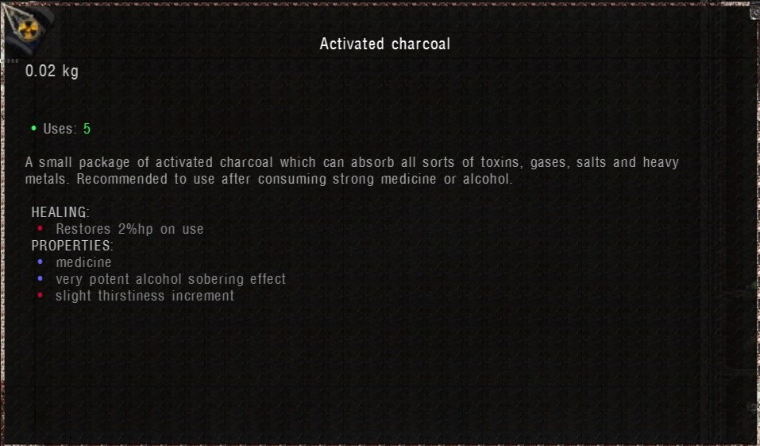
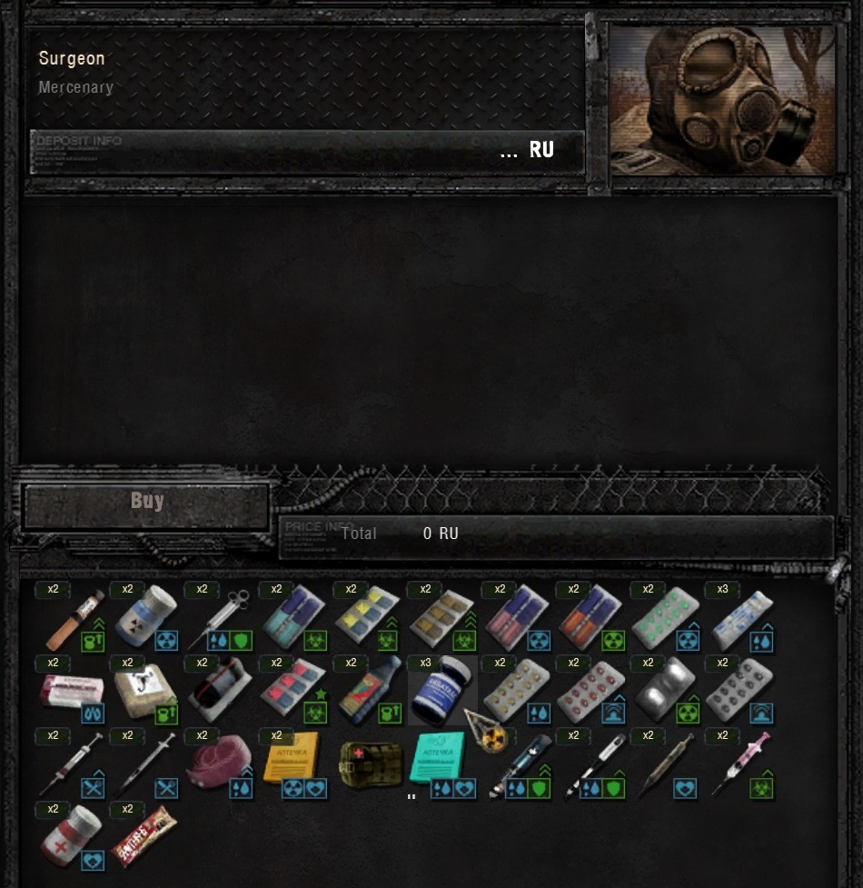
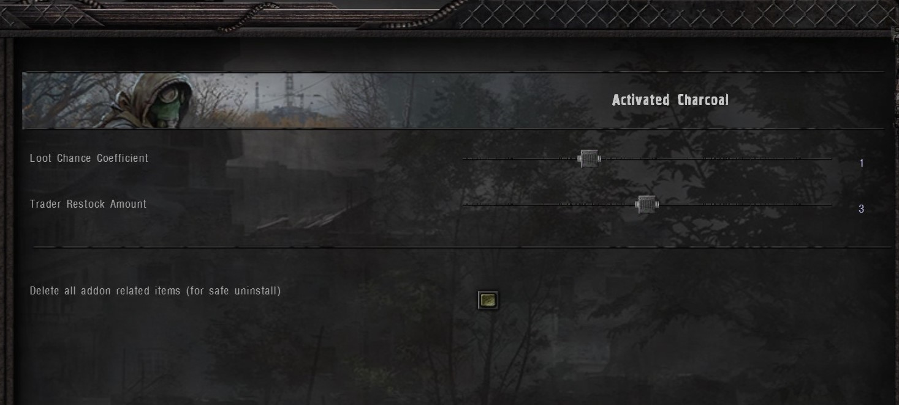

# Activated Charcoal

[)](https://github.com/Tosox/Activated-Charcoal/releases) [)](https://github.com/Tosox/Activated-Charcoal/releases/latest)

## 📜 Description

This addon brings the [Dead Air](https://www.moddb.com/mods/dead-air) drug "Activated carbon" to Anomaly.
You can find the drug on corpses, buy it from medics, or make it yourself.
It's mainly used to remove the dizziness effect e.g. after taking Yadulin or drinking vodka.

## 🔧 Installation

* Make sure that [FDDA](https://www.moddb.com/mods/stalker-anomaly/addons/food-drug-and-drinks-animations-reuploaded) and the [Modded Exes](https://github.com/themrdemonized/xray-monolith) are installed
* Download the [latest release](https://www.moddb.com/mods/stalker-anomaly/addons/dltx-activated-charcoal)
* Install the mod preferably with [Mod Organizer](https://github.com/ModOrganizer2/modorganizer/releases/)
* Open the game and enjoy

## 📝 Changelog

You can check out the latest changes in [`CHANGELOG.md`](CHANGELOG.md).

## 🎥 Preview

## 🙏 Credits

| Name | Motive | License |
| ---- | ------ | ------- |
| [Cr3pis](https://www.moddb.com/members/cr3pis) | Reused the akvatabs icon: [Cr3pis Icons](https://www.moddb.com/mods/stalker-anomaly/addons/cr3pis-icon-pack) | Proprietary |
| [Feel_Fried](https://www.moddb.com/members/feel-fried) | Reused some files from his animation addon: [FDDA - Food, Drug and Drinks Animations](https://www.moddb.com/mods/stalker-anomaly/addons/food-drug-and-drinks-animations-reuploaded) | Public Domain |
| [artifax](https://www.moddb.com/members/artifax) | For his utility scripts `trader_autoinject.script` and `workshop_autoinject.script`: [anomaly-dependencies](https://github.com/ahuyn/anomaly-dependencies) | Proprietary |
| [demonized](https://www.moddb.com/members/themrdemonized) | For his utility script `new_game_loadout_injector_mcm.script`: [anomaly-demonized-scripts](https://github.com/themrdemonized/anomaly-demonized-scripts) | Proprietary |

## 📄 License

Distributed under the MIT License. See [`LICENSE`](LICENSE) for more information.
